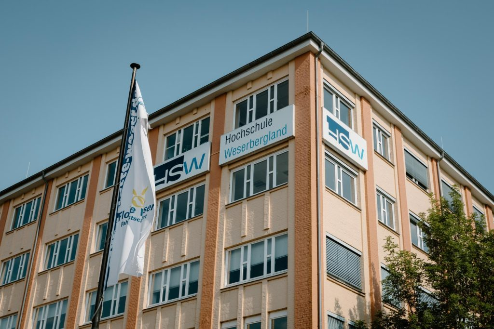

# Education

## Bachelor of Science in Business Informatics
**Hochschule Weserbergland**, Hamelin, Germany  
**August 2016 – July 2019**
- **Specialization:** Software Development
- **Thesis:** Automated heuristic pattern recognition to support the data quality in the configuration management of the web application server configurations at the Finanz Informatik

  

## IT Systems Management Assistant
**IHK Hannover**, Hanover, Germany  
**August 2013 – January 2016**
- Completed apprenticeship combining IT technical training with commercial business management
- Gained expertise in IT project coordination, system implementation, and customer service

