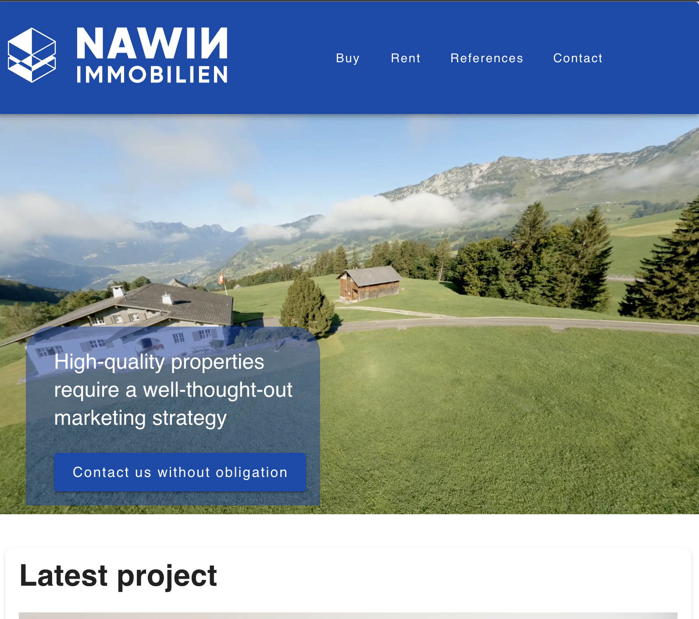
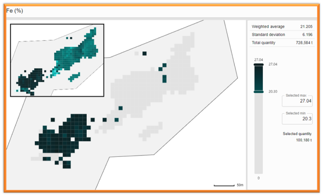
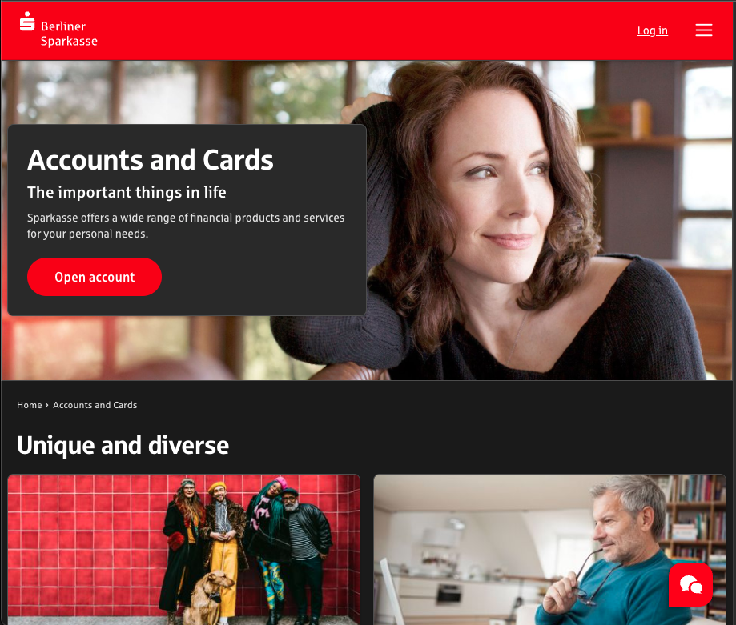

# Projects

## Real Estate Platform for NAWIN
**Company:** Private Real Estate Agency, Switzerland  
**Role:** Full-Stack Developer  
**Period:** 01/2024 – 04/2024  
**Link:** [nawin.ch](https://nawin.ch/)

**Overview:**  
Migrated an existing WordPress site to a modern Nuxt.js (Vue.js) web application, integrated with the agency’s ERP system via the SwissRets API for seamless property data delivery.

**Key Contributions:**
- Implemented the customer design based on Figma.
- Developed dynamic listing pages and components using **Nuxt.js** with server-side rendering for improved SEO and load performance.
- Integrated **SwissRets** API to fetch and display up-to-date property information directly from the ERP.
- Designed reusable Vue components (property cards, search filters, map integrations) with **Pinia** for state management.
- Implemented caching strategies and image optimization to reduce TTFB and overall payload size.
- Ensured responsive design and accessibility compliance across all devices.

**Outcome & Impact:**
- Transitioned the site from WordPress to Nuxt.js, resulting in a 50% faster page load time.
- Improved search accuracy and real-time data synchronization, enhancing user trust and engagement.

## Wenco International Mining Systems Ltd.
**Company:** Wenco International Mining Systems Ltd.  
**Role:** Full-Stack Developer  
**Period:** 05/2023 – Present  
**Link:** [Wenco Official Site](https://www.wencomine.com)

**Overview:**  
Developed both frontend and backend components for Wenco’s asset-health monitoring platform, enabling end-to-end processing of IoT data and real-time visualization.

**Key Contributions:**
- Built **NestJS** microservices on **AWS ECS (Fargate)** using **SQS**, **SNS**, and **Kafka** for reliable event-driven ingestion.
- Implemented in-memory buffering with worker threads to write Parquet files and upload to S3, preventing OOM errors.
- Created **React** dashboards with **@tanstack/react-query** and **Recharts** to display real-time metrics and health status.
- Built complex interactive maps using **React** to help mine sites view their stockpiles. 
- Developed shared UI component library with **Storybook** for consistency and accelerated feature development.
- Optimized backend performance by parallelizing data processing and reducing end-to-end latency by 30%.
- Enhanced frontend performance via code-splitting, lazy loading, and memoization, reducing initial load times by 25%.

**Outcome & Impact:**
- Achieved zero OOM failures during peak ingestion.
- Increased system throughput by 50% and user engagement metrics on dashboards by 20%.

## Uvaro Course Platform
**Company:** Uvaro  
**Role:** Front-end Developer (React & Next.js)  
**Period:** 06/2022 – 04/2023  
**Link:** [Live Course Page](https://uvaro.com/course)

**Overview:**  
Contributed to the development and enhancement of Uvaro’s flagship course platform, focusing on user-facing course pages that drive conversions and learner engagement.

**Key Contributions:**
- Implemented responsive, SEO-friendly course detail pages using **Next.js** with server-side rendering and dynamic routes.
- Built reusable React components (course cards, curriculum lists, CTA buttons) with **TypeScript** and **CSS**.
- Integrated analytics and A/B testing hooks to measure feature performance and conversion rates.
- Optimized image loading (Next/Image) and code-splitting to reduce Time-to-Interactive by 35%.
- Collaborated with design and marketing teams to align on UX enhancements and brand consistency.

**Outcome & Impact:**
- Increased average session duration on course pages by 20%.
- Improved conversion rate for “Enroll Now” CTA by 15%.

## OSPlus Neo Implementation
**Company:** Finanz Informatik GmbH & Co. KG  
**Role:** Software Developer (Front-End & Integration)  
**Period:** [08/2019] – [09/2021]  
**Link:** [Berliner Sparkasse Live Site](https://www.berliner-sparkasse.de/en/home/)

**Overview:**  
Contributed to the development and rollout of the OSPlus Neo online banking platform interface used by multiple German savings banks (Sparkassen). This modernized customer-facing portal remains in production and serves thousands of daily users.

**Key Contributions:**
- Developed responsive UI components using **React** and **TypeScript**, ensuring cross-browser compatibility and accessibility compliance.
- Integrated RESTful banking APIs for account management, transaction history, and fund transfers.
- Collaborated with backend teams to define data contracts and error-handling strategies.
- Implemented performance optimizations (lazy loading, bundling strategies) to reduce initial load time by 40%.
- Conducted end-to-end testing with **Protractor** and **Jest** to maintain high code quality and reliability.

**Outcome & Impact:**
- OSPlus Neo platform adopted by over 300 Sparkassen branches nationwide.
- Achieved a 25% increase in user satisfaction scores compared to the legacy interface.
- Reduced support tickets related to UI issues by 50% within the first quarter post-launch.

